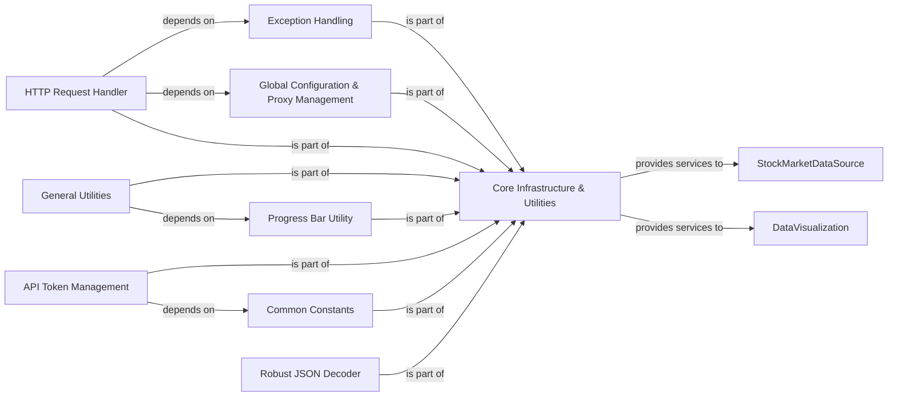

## Component Details

This is the foundational layer of `akshare`, providing essential, widely-used helper functions and global configurations. It encompasses robust JSON decoding, progress bar display, general function utilities, and critical proxy and API token management. Crucially, it centralizes all HTTP requests to external data sources, including retry mechanisms and basic error handling, and defines a comprehensive set of custom exception classes to standardize error reporting across the library.

### Core Infrastructure & Utilities

This is the foundational layer of `akshare`, providing essential, widely-used helper functions and global configurations. It encompasses robust JSON decoding, progress bar display, general function utilities, and critical proxy and API token management. Crucially, it centralizes all HTTP requests to external data sources, including retry mechanisms and basic error handling, and defines a comprehensive set of custom exception classes to standardize error reporting across the library.

**Related Classes/Methods**: _None_

### Exception Handling

Defines a comprehensive set of custom exception classes (`AkshareException`, `APIError`, `NetworkError`, `RateLimitError`, `DataParsingError`, `InvalidParameterError`) to standardize error reporting across the `akshare` library. This ensures consistent and clear error messages for developers and users.

**Related Classes/Methods**:

- `Exception Handling` (1:1)

### Global Configuration & Proxy Management

Manages global settings, primarily proxy configurations, using a singleton pattern (`AkshareConfig`). It provides methods to set and retrieve proxies globally and includes a `ProxyContext` for temporary proxy adjustments, crucial for network flexibility.

**Related Classes/Methods**:

- `Global Configuration & Proxy Management` (1:1)

### HTTP Request Handler

Centralizes all HTTP GET requests to external data sources. It implements robust retry mechanisms with exponential backoff and comprehensive error handling, raising specific custom exceptions defined in `akshare.exceptions`. It also integrates with `Global Configuration & Proxy Management` for proxy usage.

**Related Classes/Methods**:

- `HTTP Request Handler` (1:1)

### General Utilities

Provides a collection of widely-used helper functions for common data-related tasks, such as fetching paginated data from external sources and standardizing Pandas DataFrame columns. It integrates with the `Progress Bar Utility` for user feedback.

**Related Classes/Methods**:

- `General Utilities` (1:1)

### Progress Bar Utility

Offers a flexible way to display progress bars (`tqdm`) in different Python environments (e.g., console, Jupyter Notebook). This enhances user experience by providing visual feedback during long-running data fetching or processing operations.

**Related Classes/Methods**:

- `Progress Bar Utility` (1:1)

### API Token Management

Handles the secure storage and retrieval of API tokens. It manages the persistence of these tokens, typically in a user-specific file, ensuring authenticated access to various data providers.

**Related Classes/Methods**:

- `API Token Management` (1:1)

### Common Constants

Stores global constants and default values, such as standard HTTP headers and file paths for token storage. This centralizes frequently used values, promoting consistency and ease of modification across the library.

**Related Classes/Methods**:

- `Common Constants` (1:1)

### Robust JSON Decoder

Provides an advanced JSON decoding mechanism, likely for handling non-standard or complex JSON structures that might be encountered from diverse financial data sources, ensuring reliable data parsing.

**Related Classes/Methods**:

- `Robust JSON Decoder` (1:1)

### [FAQ](https://github.com/CodeBoarding/GeneratedOnBoardings/tree/main?tab=readme-ov-file#faq)