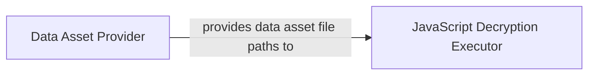

## Component Details

Final Component Overview: Data Source Asset & Decryption Management

### Data Asset Provider

This component is responsible for locating and providing paths to internal data assets, such as JavaScript files (`ths.js`) and other compressed data archives (`crypto_info.zip`), which are essential for various data processing tasks, including decryption. It acts as a central point for accessing these static data resources within the `akshare` project.

**Related Classes/Methods**:

- <a href="https://github.com/akfamily/akshare/blob/master/akshare/datasets.py#L11-L19" target="_blank" rel="noopener noreferrer">`akshare.datasets.get_ths_js` (11:19)</a>

- <a href="https://github.com/akfamily/akshare/blob/master/akshare/datasets.py#L22-L30" target="_blank" rel="noopener noreferrer">`akshare.datasets.get_crypto_info_csv` (22:30)</a>

### JavaScript Decryption Executor

This component is specialized in executing JavaScript code in a separate process to handle complex decryption logic or data transformations. It leverages the `py_mini_racer` library for JavaScript runtime and `concurrent.futures.ProcessPoolExecutor` for isolated and safe execution, preventing potential issues with long-running or resource-intensive JavaScript operations from affecting the main application.

**Related Classes/Methods**:

- <a href="https://github.com/akfamily/akshare/blob/master/akshare/utils/multi_decrypt.py#L0-L0" target="_blank" rel="noopener noreferrer">`akshare.utils.multi_decrypt.execute_js_in_executor` (0:0)</a>

- <a href="https://github.com/akfamily/akshare/blob/master/akshare/utils/multi_decrypt.py#L0-L0" target="_blank" rel="noopener noreferrer">`akshare.utils.multi_decrypt.js_executor_function` (0:0)</a>

### [FAQ](https://github.com/CodeBoarding/GeneratedOnBoardings/tree/main?tab=readme-ov-file#faq)