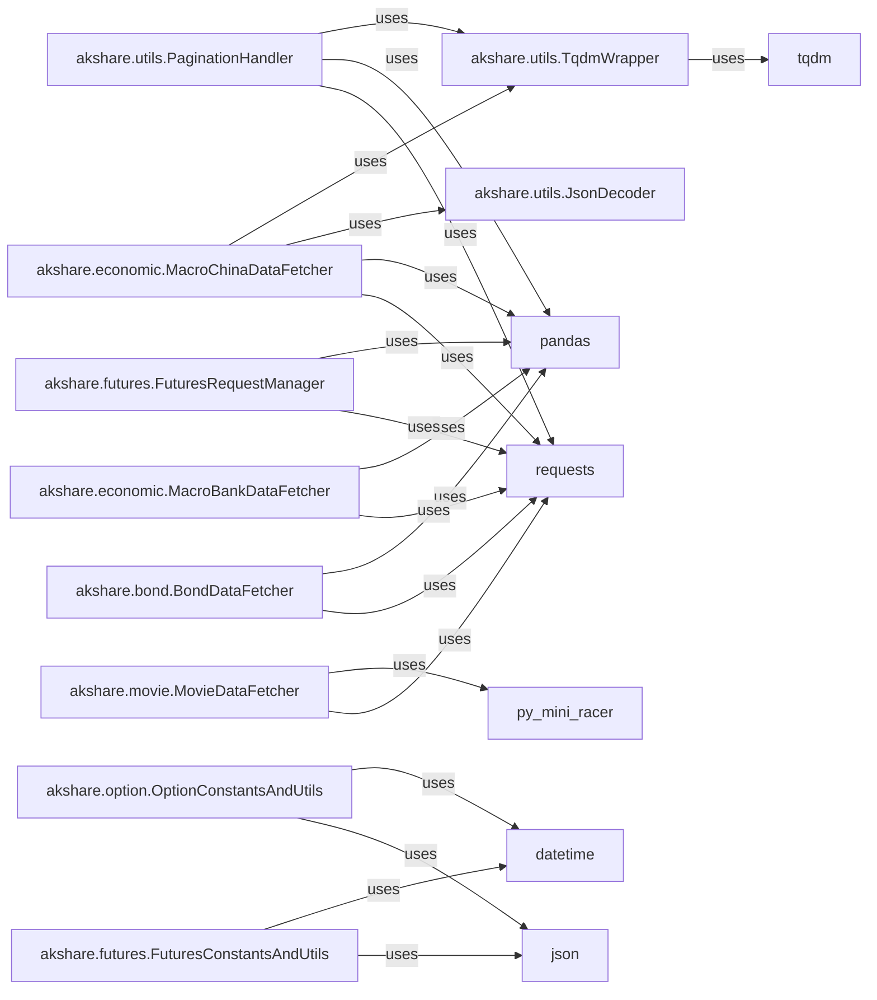

## Component Details

This module consolidates functionalities for retrieving and processing data across several distinct financial domains: futures, options, investment funds (e.g., ETFs, LOFs), bonds, and macroeconomic indicators. It covers aspects like contract information, historical data, bond issuance details, and broad economic statistics for different regions (e.g., China, USA). It also includes specialized alternative data like movie box office statistics.

### akshare.bond.BondDataFetcher

This component is responsible for fetching historical closing yield curve data specifically from China Money. It encapsulates the logic for handling HTTP requests and parsing the retrieved bond data.

**Related Classes/Methods**:

- `requests` (1:1)

- `pandas` (1:1)

### akshare.economic.MacroBankDataFetcher

This component specializes in retrieving central bank interest rate data for various countries from the Jin10 data center. It centralizes the common logic for fetching and processing this type of macroeconomic data, including pagination.

**Related Classes/Methods**:

- `requests` (1:1)

- `pandas` (1:1)

### akshare.economic.MacroChinaDataFetcher

This component provides comprehensive functionalities for retrieving a wide array of Chinese macroeconomic indicators from sources like Jin10 and Eastmoney. It includes a base function for common data fetching and pagination logic.

**Related Classes/Methods**:

- `requests` (1:1)

- `pandas` (1:1)

### akshare.futures.FuturesConstantsAndUtils

This component defines essential constants and provides utility functions crucial for handling futures data. This includes functionalities like converting date formats and determining the latest available trading dates based on a calendar.

**Related Classes/Methods**:

- `json` (1:1)

- `datetime` (1:1)

### akshare.futures.FuturesRequestManager

This component serves as a centralized wrapper for making robust HTTP requests specifically within the futures module. It abstracts the logic for network communication, including retry mechanisms to ensure reliable data fetching.

**Related Classes/Methods**:

- `requests` (1:1)

- `pandas` (1:1)

### akshare.movie.MovieDataFetcher

This component is central to retrieving movie box office data. A key responsibility is the decryption of data received from the source, indicating a specialized data processing step required to access the information.

**Related Classes/Methods**:

- `requests` (1:1)

- `py_mini_racer` (1:1)

### akshare.option.OptionConstantsAndUtils

Similar to its futures counterpart, this component in the `options` package provides constants and utility functions. These include functionalities for date conversion and determining the latest available data date for options data, relying on calendar and trading day information.

**Related Classes/Methods**:

- `json` (1:1)

- `datetime` (1:1)

### akshare.utils.TqdmWrapper

This is a core utility component that provides a standardized progress bar mechanism, wrapping the `tqdm` library. It is extensively used across various `akshare` modules to offer visual feedback to users during data fetching operations.

**Related Classes/Methods**:

- <a href="https://github.com/akfamily/akshare/blob/master/akshare/utils/tqdm.py#L1-L1" target="_blank" rel="noopener noreferrer">`tqdm` (1:1)</a>

### akshare.utils.JsonDecoder

This essential utility component is responsible for decoding JSON data. Its frequent invocation across different `akshare` modules signifies that a substantial portion of the data consumed and processed by the library is in JSON format, making it a critical component for data interoperability.

**Related Classes/Methods**: _None_

### akshare.utils.PaginationHandler

This general-purpose utility component is designed to efficiently fetch data that is spread across multiple pages (paginated). It abstracts the complex logic for iterating through pages and consolidating the data, a common requirement when interacting with web APIs.

**Related Classes/Methods**:

- `requests` (1:1)

- `pandas` (1:1)

### [FAQ](https://github.com/CodeBoarding/GeneratedOnBoardings/tree/main?tab=readme-ov-file#faq)