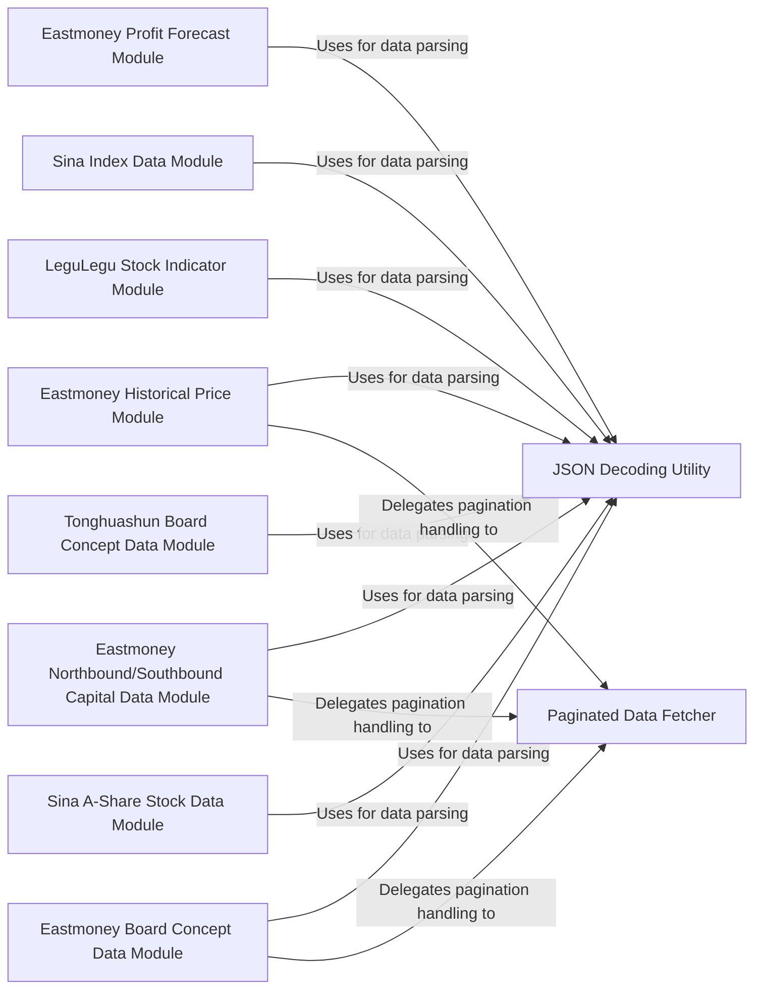

## Component Details

The Equity Market Data Module is a comprehensive subsystem designed to aggregate, process, and present various types of stock market data. It serves as the central hub for fetching fundamental information, board-specific data, fund flow analysis, shareholder details, historical price series, financial reports, research reports, profit forecasts, and technical indicators, as well as various stock market indices.

### Sina A-Share Stock Data Module

Responsible for fetching real-time and historical A-share stock data directly from Sina Finance. It is a primary and fundamental source for basic stock information, including quotes and trading details.

**Related Classes/Methods**:

- <a href="https://github.com/akfamily/akshare/blob/master/akshare/stock/stock_zh_a_sina.py#L1-L100" target="_blank" rel="noopener noreferrer">`akshare.stock.stock_zh_a_sina` (1:100)</a>

### Eastmoney Board Concept Data Module

Specializes in retrieving concept board names, real-time spot data, and historical data related to concept-based stock classifications from Eastmoney. This component is crucial for analyzing thematic investments and market trends.

**Related Classes/Methods**:

- <a href="https://github.com/akfamily/akshare/blob/master/akshare/stock/stock_board_concept_em.py#L1-L100" target="_blank" rel="noopener noreferrer">`akshare.stock.stock_board_concept_em` (1:100)</a>

### Tonghuashun Board Concept Data Module

Fetches concept board names, detailed information, and index data specifically from Tonghuashun. It often relies on external JavaScript files for data processing, indicating a more complex data retrieval mechanism.

**Related Classes/Methods**:

- <a href="https://github.com/akfamily/akshare/blob/master/akshare/stock_feature/stock_board_concept_ths.py#L1-L100" target="_blank" rel="noopener noreferrer">`akshare.stock_feature.stock_board_concept_ths` (1:100)</a>

### Eastmoney Northbound/Southbound Capital Data Module

Focuses on fetching data related to Northbound and Southbound capital flows, including detailed hold stock statistics and institutional statistics from Eastmoney. This data is vital for understanding foreign investment trends and their impact on the market.

**Related Classes/Methods**:

- <a href="https://github.com/akfamily/akshare/blob/master/akshare/stock/stock_hsgt_em.py#L1-L100" target="_blank" rel="noopener noreferrer">`akshare.stock.stock_hsgt_em` (1:100)</a>

- <a href="https://github.com/akfamily/akshare/blob/master/akshare/stock_feature/stock_hsgt_em.py#L1-L100" target="_blank" rel="noopener noreferrer">`akshare.stock_feature.stock_hsgt_em` (1:100)</a>

### LeguLegu Stock Indicator Module

Provides functions to retrieve various fundamental stock indicators, such as Price-to-Earnings (PE) ratio, Price-to-Book (PB) ratio, and dividend yield for A-shares from LeguLegu. This component is essential for fundamental analysis.

**Related Classes/Methods**:

- <a href="https://github.com/akfamily/akshare/blob/master/akshare/stock_feature/stock_a_indicator.py#L1-L100" target="_blank" rel="noopener noreferrer">`akshare.stock_feature.stock_a_indicator` (1:100)</a>

### Eastmoney Historical Price Module

Retrieves historical daily price series for stocks from Eastmoney. This is a common and indispensable source for time-series analysis, backtesting, and charting.

**Related Classes/Methods**:

- <a href="https://github.com/akfamily/akshare/blob/master/akshare/stock_feature/stock_hist_em.py#L1-L100" target="_blank" rel="noopener noreferrer">`akshare.stock_feature.stock_hist_em` (1:100)</a>

### Sina Index Data Module

Contains functions dedicated to fetching real-time and historical data for various Chinese stock indices from Sina Finance. This component is crucial for market-level analysis and benchmarking.

**Related Classes/Methods**:

- <a href="https://github.com/akfamily/akshare/blob/master/akshare/index/index_stock_zh.py#L1-L100" target="_blank" rel="noopener noreferrer">`akshare.index.index_stock_zh` (1:100)</a>

### Eastmoney Profit Forecast Module

Retrieves profit forecasts and related financial estimates for stocks from Eastmoney. This data is critical for future-oriented financial analysis and valuation.

**Related Classes/Methods**:

- <a href="https://github.com/akfamily/akshare/blob/master/akshare/stock_fundamental/stock_profit_forecast_em.py#L14-L159" target="_blank" rel="noopener noreferrer">`akshare.stock_fundamental.stock_profit_forecast_em` (14:159)</a>

### JSON Decoding Utility

This utility function is responsible for robustly decoding JSON-encoded strings into Python objects. It is critical for parsing data from various web APIs used by the data fetching modules.

**Related Classes/Methods**:

- <a href="https://github.com/akfamily/akshare/blob/master/akshare/utils/demjson.py#L1-L100" target="_blank" rel="noopener noreferrer">`akshare.utils.demjson` (1:100)</a>

### Paginated Data Fetcher

A generic function designed to interact with web APIs that return data in a paginated format. It automates the process of requesting multiple pages and consolidating the results, significantly simplifying data retrieval from large datasets.

**Related Classes/Methods**:

- <a href="https://github.com/akfamily/akshare/blob/master/akshare/utils/func.py#L1-L100" target="_blank" rel="noopener noreferrer">`akshare.utils.func` (1:100)</a>

### [FAQ](https://github.com/CodeBoarding/GeneratedOnBoardings/tree/main?tab=readme-ov-file#faq)