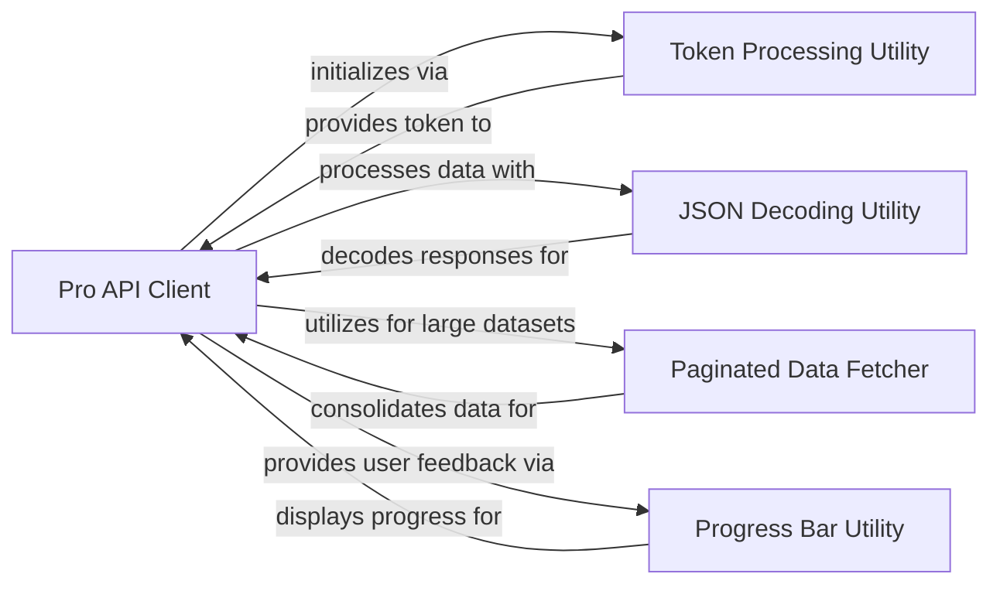

## Component Details

A final component overview for the `Pro API Client` and its most fundamental related components, selected based on their direct relevance to the `Pro API Client`'s functionality (authentication, data parsing, and common utilities for data fetching).

### Pro API Client

This component provides a dedicated, high-level interface for interacting with premium or "Pro" APIs. It encapsulates the logic for token-based authentication, dynamic construction of API requests, and robust parsing of structured JSON responses into user-friendly pandas DataFrames. It serves as a specialized client for accessing premium data, abstracting away the complexities of the Pro API's interaction protocols and offering a convenient, method-based access pattern.

**Related Classes/Methods**:

- <a href="https://github.com/akfamily/akshare/blob/master/akshare/pro/data_pro.py#L1-L1" target="_blank" rel="noopener noreferrer">`akshare.pro.data_pro` (1:1)</a>

- <a href="https://github.com/akfamily/akshare/blob/master/akshare/pro/client.py#L1-L1" target="_blank" rel="noopener noreferrer">`akshare.pro.client` (1:1)</a>

### Token Processing Utility

This utility handles the retrieval and management of API tokens, likely storing and providing them for authentication purposes across different API clients. It ensures secure and efficient access to token-protected APIs.

**Related Classes/Methods**:

- <a href="https://github.com/akfamily/akshare/blob/master/akshare/utils/token_process.py#L1-L1" target="_blank" rel="noopener noreferrer">`akshare.utils.token_process` (1:1)</a>

### JSON Decoding Utility

This utility function is responsible for decoding JSON-encoded strings into Python objects (e.g., dictionaries, lists). It handles various JSON parsing requirements, including encoding detection and error management, ensuring that raw API responses are correctly interpreted.

**Related Classes/Methods**:

- <a href="https://github.com/akfamily/akshare/blob/master/akshare/utils/demjson.py#L1-L1" target="_blank" rel="noopener noreferrer">`akshare.utils.demjson` (1:1)</a>

### Paginated Data Fetcher

A generic function designed to interact with web APIs that return data in a paginated format. It automates the process of requesting multiple pages and consolidating the results into a single Pandas DataFrame. This is frequently used for data sourced from Eastmoney and potentially other paginated Pro APIs.

**Related Classes/Methods**:

- <a href="https://github.com/akfamily/akshare/blob/master/akshare/utils/func.py#L1-L1" target="_blank" rel="noopener noreferrer">`akshare.utils.func` (1:1)</a>

### Progress Bar Utility

This utility provides a `tqdm` object, which is used to display intelligent progress bars for iterative operations. It adapts to the execution environment (e.g., Jupyter Notebook or standard console) to ensure optimal user experience during data fetching.

**Related Classes/Methods**:

- <a href="https://github.com/akfamily/akshare/blob/master/akshare/utils/tqdm.py#L1-L1" target="_blank" rel="noopener noreferrer">`akshare.utils.tqdm` (1:1)</a>

### [FAQ](https://github.com/CodeBoarding/GeneratedOnBoardings/tree/main?tab=readme-ov-file#faq)