```mermaid

graph LR

    Core_Infrastructure_Utilities["Core Infrastructure & Utilities"]

    Data_Source_Asset_Decryption_Management["Data Source Asset & Decryption Management"]

    Pro_API_Client["Pro API Client"]

    Equity_Market_Data_Module["Equity Market Data Module"]

    Derivatives_Fixed_Income_Economic_Data_Module["Derivatives, Fixed Income & Economic Data Module"]

    Core_Infrastructure_Utilities -- "provides core services to" --> Equity_Market_Data_Module

    Core_Infrastructure_Utilities -- "provides core services to" --> Derivatives_Fixed_Income_Economic_Data_Module

    Core_Infrastructure_Utilities -- "provides core services to" --> Pro_API_Client

    Data_Source_Asset_Decryption_Management -- "provides decryption assets to" --> Equity_Market_Data_Module

    Data_Source_Asset_Decryption_Management -- "provides decryption assets to" --> Derivatives_Fixed_Income_Economic_Data_Module

    Pro_API_Client -- "utilizes" --> Core_Infrastructure_Utilities

    Equity_Market_Data_Module -- "depends on" --> Core_Infrastructure_Utilities

    Equity_Market_Data_Module -- "leverages" --> Data_Source_Asset_Decryption_Management

    Derivatives_Fixed_Income_Economic_Data_Module -- "depends on" --> Core_Infrastructure_Utilities

    Derivatives_Fixed_Income_Economic_Data_Module -- "leverages" --> Data_Source_Asset_Decryption_Management

    click Core_Infrastructure_Utilities href "https://github.com/akfamily/akshare/blob/main/.codeboarding//Core_Infrastructure_Utilities.md" "Details"

    click Data_Source_Asset_Decryption_Management href "https://github.com/akfamily/akshare/blob/main/.codeboarding//Data_Source_Asset_Decryption_Management.md" "Details"

    click Pro_API_Client href "https://github.com/akfamily/akshare/blob/main/.codeboarding//Pro_API_Client.md" "Details"

    click Equity_Market_Data_Module href "https://github.com/akfamily/akshare/blob/main/.codeboarding//Equity_Market_Data_Module.md" "Details"

    click Derivatives_Fixed_Income_Economic_Data_Module href "https://github.com/akfamily/akshare/blob/main/.codeboarding//Derivatives_Fixed_Income_Economic_Data_Module.md" "Details"

```

## Component Details

The architecture of `akshare` is designed around a modular approach, separating core functionalities from specific data domain implementations. This structure allows for efficient data retrieval, robust error handling, and flexible integration of various financial data sources. The five fundamental components are: Core Infrastructure & Utilities, Data Source Asset & Decryption Management, Pro API Client, Equity Market Data Module, and Derivatives, Fixed Income & Economic Data Module.

### Core Infrastructure & Utilities

This is the foundational layer of `akshare`, providing essential, widely-used helper functions and global configurations. It encompasses robust JSON decoding, progress bar display, general function utilities, and critical proxy management. Crucially, it centralizes all HTTP requests to external data sources, including retry mechanisms and basic error handling, and defines a comprehensive set of custom exception classes to standardize error reporting across the library. It also manages API tokens for various data providers.

**Related Classes/Methods**:

- <a href="https://github.com/akfamily/akshare/blob/master/akshare/utils/func.py#L0-L0" target="_blank" rel="noopener noreferrer">`akshare.utils.func` (0:0)</a>

- <a href="https://github.com/akfamily/akshare/blob/master/akshare/utils/demjson.py#L0-L0" target="_blank" rel="noopener noreferrer">`akshare.utils.demjson` (0:0)</a>

- <a href="https://github.com/akfamily/akshare/blob/master/akshare/utils/context.py#L0-L0" target="_blank" rel="noopener noreferrer">`akshare.utils.context` (0:0)</a>

- <a href="https://github.com/akfamily/akshare/blob/master/akshare/utils/tqdm.py#L0-L0" target="_blank" rel="noopener noreferrer">`akshare.utils.tqdm` (0:0)</a>

- <a href="https://github.com/akfamily/akshare/blob/master/akshare/utils/token_process.py#L0-L0" target="_blank" rel="noopener noreferrer">`akshare.utils.token_process` (0:0)</a>

- <a href="https://github.com/akfamily/akshare/blob/master/akshare/request.py#L0-L0" target="_blank" rel="noopener noreferrer">`akshare.request` (0:0)</a>

- <a href="https://github.com/akfamily/akshare/blob/master/akshare/exceptions.py#L0-L0" target="_blank" rel="noopener noreferrer">`akshare.exceptions` (0:0)</a>

### Data Source Asset & Decryption Management

This component is specialized in managing and providing access to internal data assets, primarily JavaScript files (e.g., `ths.js`, `cninfo.js`) that are often required for decrypting or accessing data from specific providers. It also includes the functionality to execute these JavaScript codes in a separate process, which is crucial for handling complex data encryption/decryption logic employed by certain data sources.

**Related Classes/Methods**:

- <a href="https://github.com/akfamily/akshare/blob/master/akshare/datasets.py#L0-L0" target="_blank" rel="noopener noreferrer">`akshare.datasets` (0:0)</a>

- <a href="https://github.com/akfamily/akshare/blob/master/akshare/utils/multi_decrypt.py#L0-L0" target="_blank" rel="noopener noreferrer">`akshare.utils.multi_decrypt` (0:0)</a>

### Pro API Client

This component offers a dedicated, high-level interface for interacting with premium or "Pro" APIs. It handles specific token-based authentication, constructs API requests tailored for these services, and parses the structured responses into user-friendly pandas DataFrames. It acts as a specialized client for accessing premium data, abstracting away the complexities of the Pro API's interaction protocols.

**Related Classes/Methods**:

- <a href="https://github.com/akfamily/akshare/blob/master/akshare/pro/data_pro.py#L0-L0" target="_blank" rel="noopener noreferrer">`akshare.pro.data_pro` (0:0)</a>

- <a href="https://github.com/akfamily/akshare/blob/master/akshare/pro/client.py#L0-L0" target="_blank" rel="noopener noreferrer">`akshare.pro.client` (0:0)</a>

### Equity Market Data Module

This comprehensive module aggregates all functionalities related to fetching, processing, and presenting various types of stock market data. This includes fundamental information, board-specific data (concept, industry), fund flow analysis, shareholder details, historical price series, financial reports, research reports, profit forecasts, and technical indicators. It also covers the retrieval of various stock market indices.

**Related Classes/Methods**:

- `akshare.stock` (0:0)

- `akshare.stock_feature` (0:0)

- `akshare.stock_fundamental` (0:0)

- `akshare.index` (0:0)

### Derivatives, Fixed Income & Economic Data Module

This module consolidates functionalities for retrieving and processing data across several distinct financial domains: futures, options, investment funds (e.g., ETFs, LOFs), bonds, and macroeconomic indicators. It covers aspects like contract information, historical data, bond issuance details, and broad economic statistics for different regions (e.g., China, USA). It also includes specialized alternative data like movie box office statistics.

**Related Classes/Methods**:

- `akshare.futures` (0:0)

- `akshare.option` (0:0)

- `akshare.fund` (0:0)

- `akshare.bond` (0:0)

- `akshare.economic` (0:0)

- `akshare.movie` (0:0)

### [FAQ](https://github.com/CodeBoarding/GeneratedOnBoardings/tree/main?tab=readme-ov-file#faq)